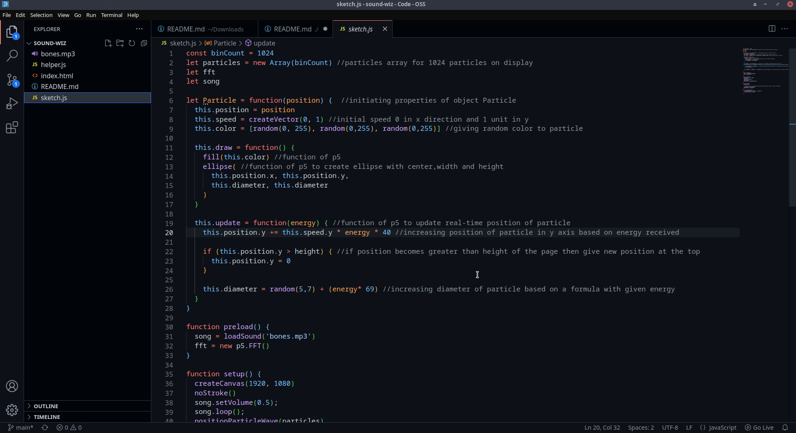

# sound-wiz

A sound visualizer for mp3 songs built on p5.js
## Run Locally

Clone the project

```bash
  git clone https://github.com/shivang0-0/sound-wiz.git
```

Go to the project directory

```bash
  cd sound-wiz
```

Getting ahead
```bash
  use live server or open index.html directly
```


## Screenshots




## Contributing

Contributions are always welcome!

Just create a fork for the project and clone that fork.  


